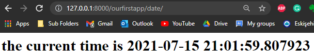
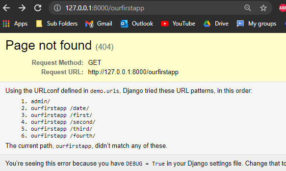
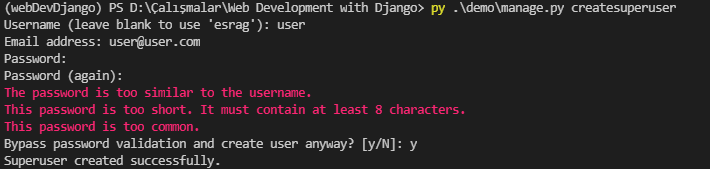

# WebDevDjango
In this project, I learned the web framework Django. I watched Edureka's "Full Stack Web Development Using Django" video from YouTube.

I learned how to create a Django project and made one function to show the current date and time.

I made a couple of functions which can be seen in the picture below.

Also, I learned how to create a superuser to login into as Django administration.

The link: https://www.youtube.com/watch?v=xyJdDxOSmV0
